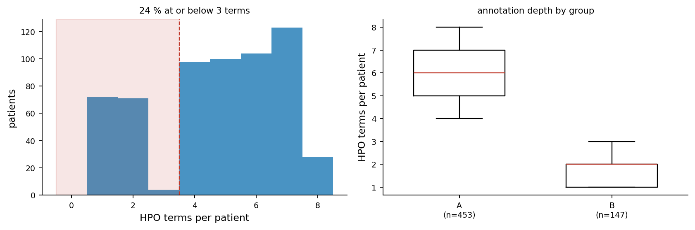
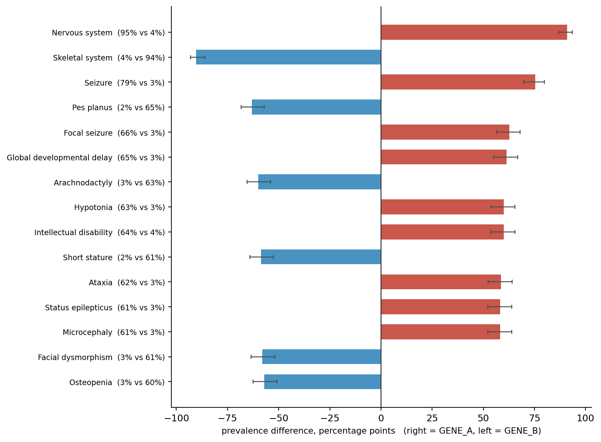
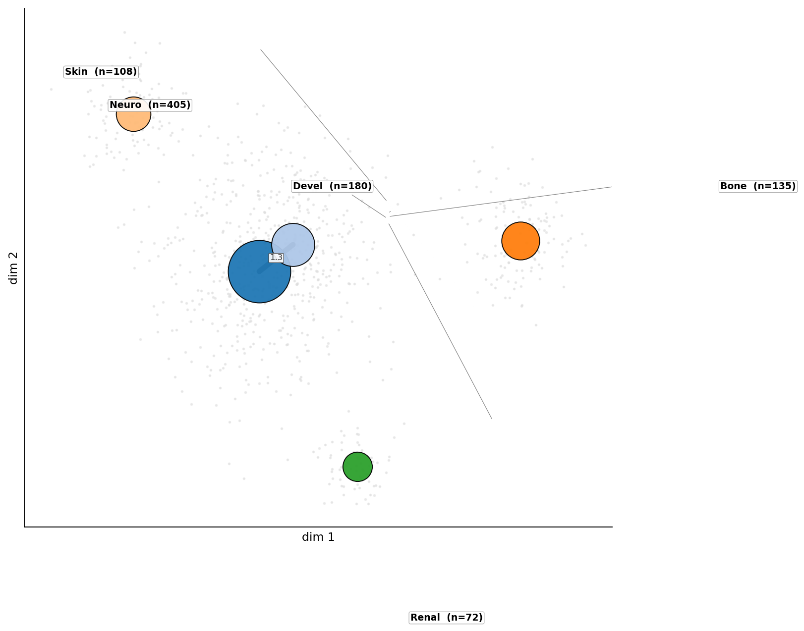
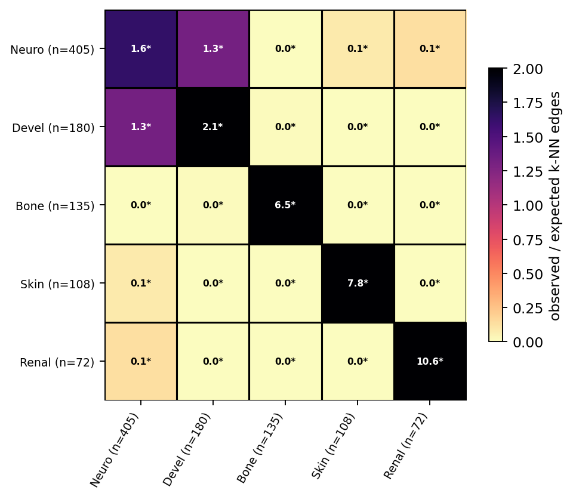
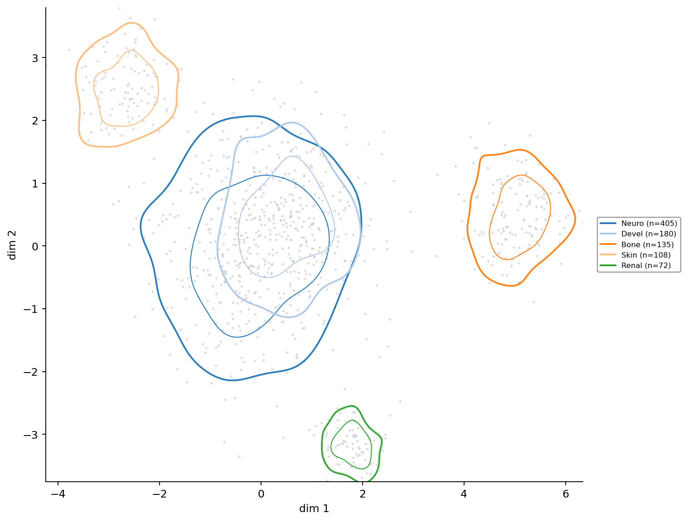
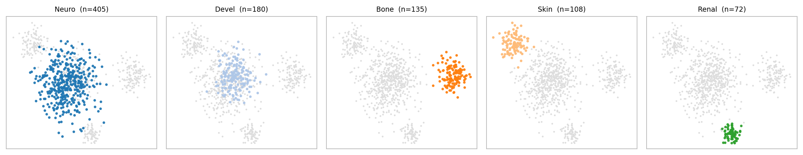
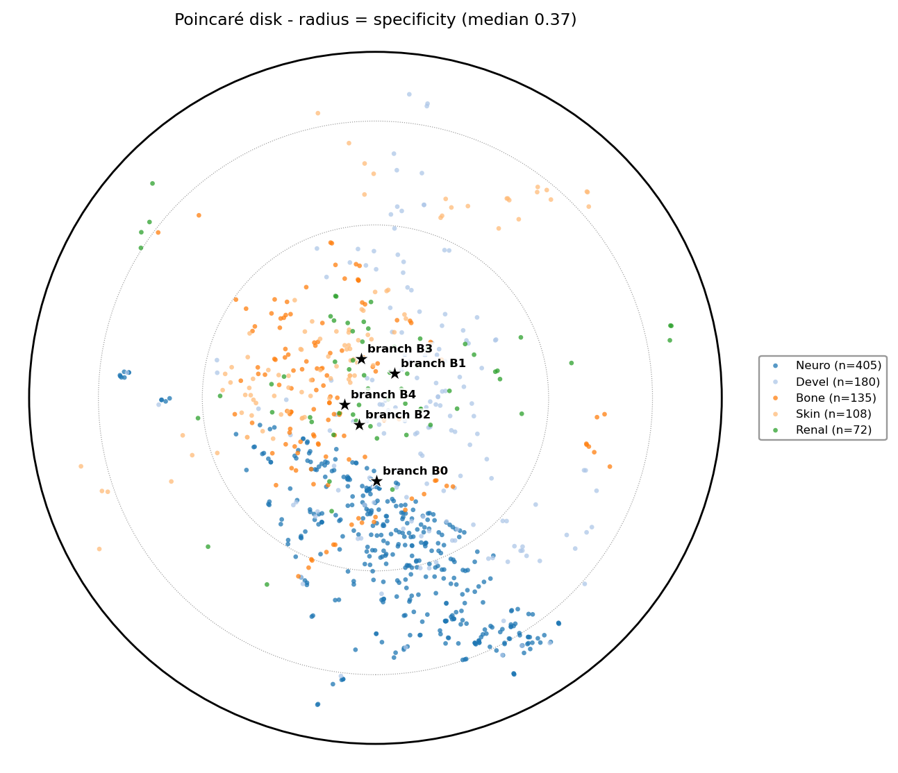
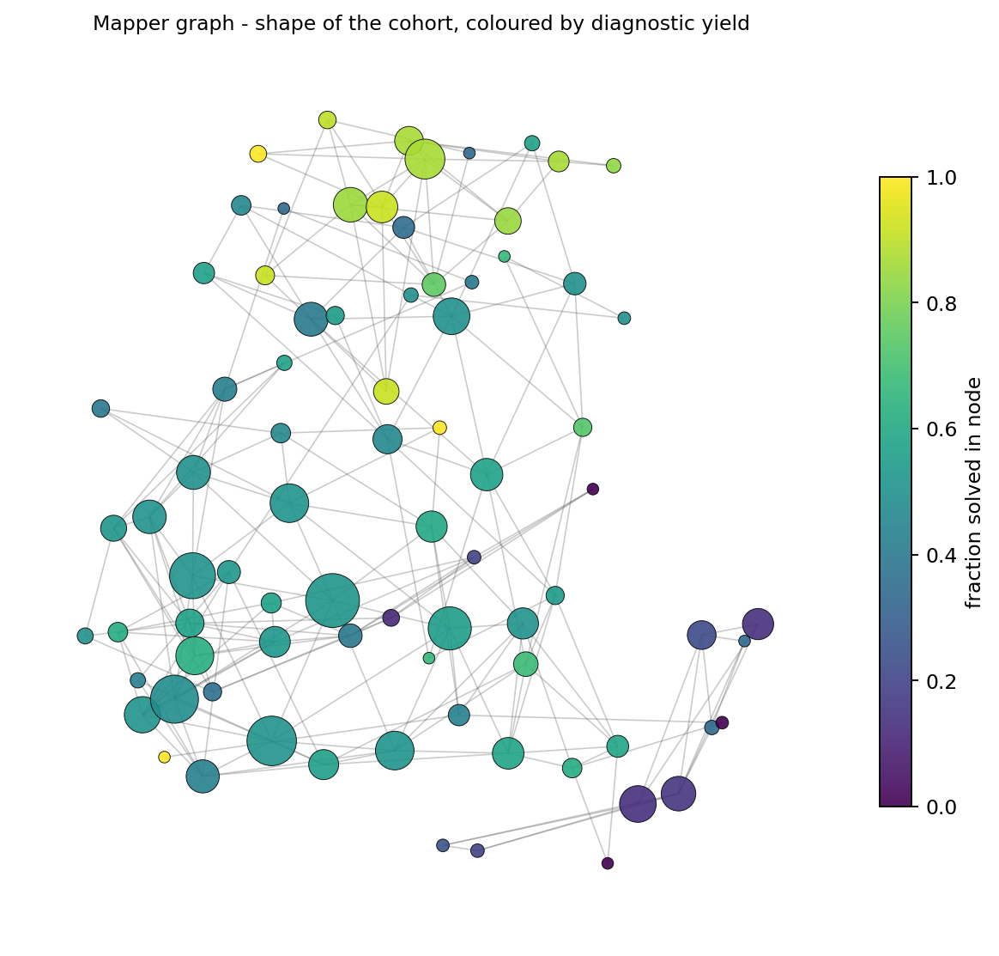

# phenotopo

**A QC and explainability toolkit for phenotype cohorts.**

[](https://github.com/MargoSolo/phenotopo/actions/workflows/tests.yml)
[](https://www.python.org/)
[](LICENSE)
[](https://pypi.org/project/phenotopo/)
[](CHANGELOG.md)

Two things go wrong when a rare-disease cohort is analysed by HPO terms.

The first is **bookkeeping mistaken for biology**: some patients were phenotyped in
two vague terms and others in twenty specific ones, the difference tracks a site or
a clinician, and every map then shows structure that is really annotation depth.
The second is **clusters that are not there**: a cohort described by phenotype is
usually a continuum with local structure, and one UMAP with twenty colours invites
everyone to read islands into it.

`phenotopo` is built around those two failures. It scores how well each patient was
phenotyped and flags when the group signal might be bookkeeping; it finds the
patients who sit away from their own group; it says which phenotypes actually
separate two groups, tested in a way that respects the ontology; and it reports
cohort structure only where the answer survives a change of distance, of *k* and of
resampling. Treating a cohort as a continuum rather than a set of clusters is the
methodology underneath; QC and explainability are what it is for.

Everything runs locally. No patient data leaves the machine, and the library makes
no network calls — the single exception is the explicit `phenotopo ontology install`
command, which prints the URL it fetches.

```bash
pip install phenotopo
phenotopo demo          # a report from a synthetic cohort, in a browser, in 30 seconds
```

---

## Installation

```bash
pip install phenotopo                 # core: cohorts, QC, outliers, comparison, connectivity
pip install "phenotopo[hyperbolic]"   # + Poincaré disk (gensim)
pip install "phenotopo[tda]"          # + Mapper graph (kmapper)
pip install "phenotopo[all]"          # everything, incl. umap-learn
```

For development, clone the repository and `pip install -e ".[dev]"`.

If `adjustText` is installed, overlapping labels on the connectivity graph and the
Poincaré disk are pushed apart automatically; without it the plots still work.

## Without writing Python

```bash
phenotopo demo                                             # see what a report looks like
phenotopo ontology install hp                              # cache the HPO release once
phenotopo report patients/ --labels diagnosis --compare GENE_A GENE_B -o report.html
```

`report` takes a directory of Phenopackets, a single `.json` packet, or a CSV/XLSX
table of HPO terms, and writes the same self-contained HTML file the Python API
produces. This is not a substitute for a real interface — it is what makes the tool
usable by someone who will not open a notebook.

## Quick start

```python
import phenotopo as pt

cohort = pt.from_phenopackets("patients/", ontology="hp.obo")   # or from_hpo_table(df, ...)
D      = cohort.distance()                                      # SimGIC, the ontology-aware default
qc     = pt.phenotype_qc(cohort)                                # how was each patient annotated?
bias   = pt.annotation_bias(qc, cohort.labels("site"),          # could the group signal be bookkeeping?
                            distance=D)
out    = pt.patient_outliers(D, cohort.labels("diagnosis"),     # who sits away from their group?
                             ids=cohort.ids)
diff   = pt.explain_groups(cohort, cohort.labels("gene"),       # which phenotypes separate them?
                           "GENE_A", "GENE_B")
pt.cohort_report(cohort, labels="diagnosis", distance=D,        # one local HTML file
                 comparisons=diff, path="cohort_report.html")
```

A `Cohort` is optional throughout: every analysis function also takes a plain
distance matrix and an array of labels, so `phenotopo` sits on top of a pipeline
you already have rather than replacing it.

### Similarity, and which fields are actually used

`cohort.distance()` is **SimGIC** — the IC-weighted Jaccard of the propagated term
sets (Pesquita et al. 2008), the ontology-aware measure the HPO literature uses.
`distance("cosine")` (cosine between IC-weighted propagated vectors) is kept as a
sensitivity analysis, and `cohort.distances()` returns both, ready to hand to the
robustness protocol. Both are hierarchy-aware: two patients sharing no term but
sharing an ancestor are still similar.

`from_phenopackets` reads GA4GH Phenopackets v2 and keeps what a bare list of term
IDs throws away. What each field currently affects — stated plainly, because storing
a field is not the same as using it:

| Field | Read | Used by |
|---|---|---|
| present phenotypes | yes | everything |
| **excluded** phenotypes (looked for and absent) | yes | `phenotype_qc`; `distance(..., negatives="use")`, where a shared ruled-out phenotype makes two patients more similar; reported as a separate column by `explain_groups` and never mixed into the test |
| **onset** per observation | yes | `phenotype_qc` completeness only — `distance(..., onset=...)` is declared and raises, rather than pretending |
| disease, gene, sex | yes | metadata, so `labels("gene")` and `explain_groups` work straight after reading |

`not recorded` and `looked for and absent` are different observations, and only the
second is evidence of absence — so negatives are opt-in and refuse to run on a cohort
where absence was never recorded.

---

The figures below come from [`examples/quickstart.py`](examples/quickstart.py), run on
synthetic cohorts with *designed* faults and structure, so each can be checked against
ground truth.

## 1 · Phenotyping quality

```python
qc = pt.phenotype_qc(cohort)
qc["summary"]        # median terms, % low depth, % low specificity, % redundant, ...
qc["flagged"]        # worst-annotated patients first, with reasons
pt.plot_qc(qc, cohort.labels("site"))
```

<p align="center"></p>

Per patient: terms asserted and after propagation, explicitly excluded phenotypes,
observations with an onset, mean and total information content, mean ontology depth,
**redundant ancestor terms** (a term recorded next to its own child — bookkeeping, not
information), the specificity percentile, and flags.

The flags are deliberately **relative to this cohort and descriptive**:
`LOW_ANNOTATION_DEPTH`, `LOW_SPECIFICITY_RELATIVE_TO_COHORT`, `HIGH_REDUNDANCY`,
resolving to `review recommended`. Six well-chosen terms can describe a skeletal
dysplasia completely while fifteen vague ones describe a neurodevelopmental case
badly, so the tool never declares a patient "under-phenotyped" in absolute terms.

Then the question that decides whether any of the rest can be believed:

```python
bias = pt.annotation_bias(qc, labels, distance=D)
bias["kruskal"]      # do the groups differ in annotation depth? H, p, epsilon-squared
bias["recovery"]     # {'phenotype': 0.92, 'annotation_only': 1.00, 'confound_risk': 'HIGH', ...}
```

Group labels are predicted twice by cross-validated k-NN — from the phenotype
distance, and from **how much was written down alone** (`n_terms`, `n_propagated`).
Specificity measures are deliberately excluded from that second model: they depend on
*which* terms a patient has, so including them would report real biology as bias.

The result is an **annotation-confound risk** (LOW / MODERATE / HIGH), not a verdict.
That annotation counts predict the group does *not* establish that the separation is
caused by them: a group that genuinely differs in phenotype severity is usually also
annotated more thoroughly, and the chain runs group → severity → annotation depth.
HIGH means the analysis must address the confound — by matching, stratification or a
depth-controlled comparison — not that the finding is an artefact.

## 2 · Outliers — who sits away from their own group

```python
out = pt.patient_outliers(D, labels, ids=cohort.ids, k=15)
pt.explain_outlier(cohort, index, D, labels)
```

Two things get called an outlier, and mixing them produces nonsense, so they are
reported separately: **isolation** (far from everybody — a sparse or unusual
phenotype) and **discordance** (plenty of close neighbours, and they belong to a
different group). `explain_outlier` names the terms that make a patient unusual for
its neighbourhood, and — often more useful — the terms its neighbourhood has that it
lacks, which is as likely to be a phenotyping gap as biology.

The output is never a claim that a diagnosis is wrong. It is *phenotypically
discordant with the assigned group*: a candidate for review in a diagnostic cohort,
a genotype–phenotype study or a reclassification project.

## 3 · What separates two groups

```python
diff = pt.explain_groups(cohort, labels, "GENE_A", "GENE_B", min_effect=0.15)
diff["top"]     # term, name, prevalence in each group, effect in pp with CI, adjusted p
pt.plot_explain(diff)
```

<p align="center"></p>

One test per HPO term, sorted by p-value, answers this badly, for two reasons
specific to ontologies:

- **The terms are not independent.** After propagation a patient annotated *Status
  epilepticus* is also annotated *Seizure* and everything up to the root, so one
  finding lights up a whole ancestor chain and Benjamini–Hochberg assumes far more
  independence than exists. `explain_groups` therefore uses a **Westfall–Young max-T
  permutation**: labels are shuffled and the *largest* prevalence difference over all
  terms is recorded each time, so the null already contains the ontology's
  correlation structure and the adjusted p-values control the family-wise error rate.
- **Significance is not the answer.** With a few thousand patients a 2-point
  difference is significant and clinically empty. Terms are reported only above an
  explicit **effect-size threshold** in percentage points, with a Newcombe confidence
  interval, and redundant ancestors of an already-reported term are pruned — ties go
  to the deeper term, so *Seizure* is dropped for *Status epilepticus* and never the
  other way round.

## 4 · Cohort structure, only where it is robust

```python
res = pt.connectivity_robustness({"cosine": D_cos, "simgic": D_gic}, labels,
                                 ks=(10, 15, 30), min_size=100)
res["summary"]        # per pair: ratio, CI, range across configurations, verdict
pt.plot_forest(res)
```

The connectivity ratio compares the k-NN edges crossing between two groups with the
number expected under a degree-preserving null (the PAGA abstraction, Wolf et al.
2019): `1` is random mixing, `> 1` blending, `< 1` separation, and the diagonal is
within-group cohesion. A ratio from one distance, one *k* and one sample is a single
draw, so the protocol (i) drops groups below `min_size`, whose expected counts are
tiny and whose ratios explode; (ii) recomputes every ratio for every distance × *k*
with a permutation *q* and a bootstrap CI; (iii) applies an **effect-size threshold**,
not just significance; and (iv) issues a verdict only if the criterion holds in
**every** configuration. What survives is a sentence you can write down.

The underlying views, when you want to look rather than test:

```python
conn = pt.group_connectivity(pt.knn_graph(distance=D, k=15), labels)
pt.plot_connectivity(conn, embedding=emb, labels=labels)          # node-link, few groups
pt.plot_connectivity_heatmap(conn, min_size=30,                   # every pair, many groups
                             significance=pt.permutation_test(pt.knn_graph(distance=D), labels))
```

<p align="center">


</p>

Nodes sit at each group's median position, node area is group size, edge width ∝ log
ratio. Past about eight groups a node–link drawing stops being readable and the
heatmap is the honest form: every pair, the separated ones (`ratio < 1`) included,
`*` where the permutation q survives correction.

## 5 · Looking at the continuum

```python
pt.plot_density(emb, labels, levels=(0.5, 0.85))    # where groups overlap, drawn not hidden
pt.plot_small_multiples(emb, labels, ncols=5)       # one panel per group, no 20-colour legend
```

<p align="center">


</p>

Two further views, for hierarchy and shape:

```python
from phenotopo.hyperbolic import poincare_terms, place_patients, plot_disk
from phenotopo.mapper import mapper_graph, node_values, plot_mapper
```

<p align="center">


</p>

The **Poincaré disk** fits a hierarchy into two dimensions with the root at the centre
and specific leaves at the rim; patients sit at the Einstein midpoint of their terms,
so phenotyping specificity becomes a radial axis — the annotation-depth confound made
geometric instead of hidden. The **Mapper graph** covers the space with overlapping
bins and clusters locally inside each, showing branches, bridges and flares without
forcing every patient into a cluster; colour it by any per-patient outcome (here a
synthetic diagnostic yield) to see where that outcome concentrates.

## 6 · One file to hand over

```python
pt.cohort_report(cohort, labels="diagnosis", distance=D,
                 robustness=res, comparisons=[diff], path="cohort_report.html")
```

Cohort overview, QC and the annotation-bias verdict, the outlier list, the robustness
table with its forest plot and every group comparison — in a single self-contained
HTML file, figures embedded, no server and no network. It opens in a browser and
survives being emailed.

---

## Reading the connectivity ratio

| `ratio` | Meaning |
|---|---|
| ≫ 1 | groups blend — many more cross edges than chance |
| ≈ 1 | as connected as random mixing |
| ≪ 1 | separated — a real boundary in phenotype space |

The null preserves every group's total degree (the configuration model behind
modularity), so large groups are not rewarded merely for being large.

## API

| Module | Contents |
|---|---|
| `phenotopo.cohort` | `Cohort`, `Ontology`, `from_hpo_table`, `from_phenopackets` |
| `phenotopo.qc` | `phenotype_qc`, `annotation_bias`, `plot_qc` |
| `phenotopo.outliers` | `patient_outliers`, `explain_outlier` |
| `phenotopo.explain` | `explain_groups`, `plot_explain` |
| `phenotopo.report` | `cohort_report` |
| `phenotopo.graph` | `knn_graph`, `group_connectivity`, `group_centroids` |
| `phenotopo.stats` | `permutation_test`, `bootstrap_ratio`, `benjamini_hochberg` |
| `phenotopo.robustness` | `connectivity_robustness`, `plot_forest` |
| `phenotopo.layout` | `plot_connectivity`, `plot_connectivity_heatmap`, `plot_density`, `plot_small_multiples`, `default_palette` |
| `phenotopo.hyperbolic` | `poincare_terms`, `einstein_midpoint`, `place_patients`, `radial_specificity`, `plot_disk` |
| `phenotopo.mapper` | `mapper_graph`, `node_values`, `plot_mapper` |
| `phenotopo.data` | `synthetic_cohort`, `synthetic_hpo_cohort`, `synthetic_hierarchy`, `synthetic_term_lists` |
| `phenotopo.cli` | `phenotopo demo`, `phenotopo report`, `phenotopo ontology install/path` |

## Scope

`phenotopo` deliberately does **not** prioritise genes or diagnoses for a single
patient — Exomiser and LIRICAL do that — and does not capture phenotypes, pedigrees
or variants, which is PhenoTips' job. It sits after capture and beside
prioritisation: quality control, cohort structure, outliers and group comparison,
reading Phenopackets so it fits between the two.

## Citation

See [`CITATION.cff`](CITATION.cff).

## Tests

```bash
pytest -q
```

Runs on synthetic data only, by design: **no patient data belongs in this
repository**, and `.gitignore` blocks ontology dumps, cohort files and analysis
output. The figures in this README come from synthetic cohorts with designed
structure, which makes them checkable but not evidence about real cohorts; a
case study on public, published cases (Phenopacket Store) is the next release.

## References

- Wolf F.A. et al. *PAGA: graph abstraction reconciles clustering with trajectory inference through a topology preserving map of single cells.* Genome Biology, 2019.
- Westfall P.H., Young S.S. *Resampling-based multiple testing.* Wiley, 1993 — max-T procedure.
- Newcombe R.G. *Interval estimation for the difference between independent proportions.* Statistics in Medicine, 1998.
- Pesquita C. et al. *Metrics for GO based protein semantic similarity: a systematic evaluation.* BMC Bioinformatics, 2008 — SimGIC.
- Jacobsen J.O.B. et al. *The GA4GH Phenopacket schema defines a computable representation of clinical data.* Nature Biotechnology, 2022.
- Nickel M., Kiela D. *Poincaré embeddings for learning hierarchical representations.* NeurIPS, 2017.
- Ungar A.A. *Analytic hyperbolic geometry.* World Scientific, 2005 — Einstein midpoint.
- Singh G., Mémoli F., Carlsson G. *Topological methods for the analysis of high dimensional data sets.* Eurographics, 2007 — Mapper.
- van Veen H.J. et al. *Kepler Mapper.* Journal of Open Source Software, 2019.

## License

MIT — see [LICENSE](LICENSE).
