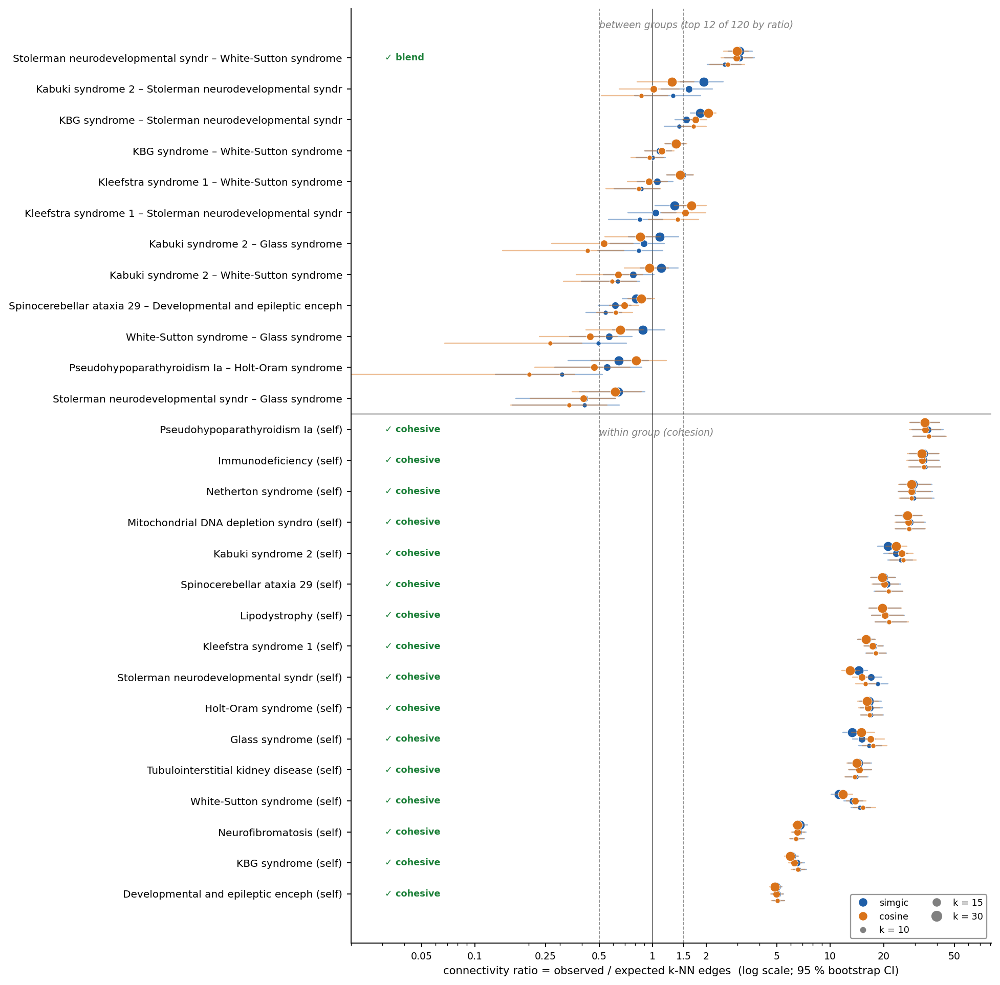
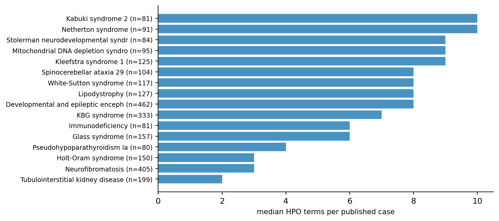
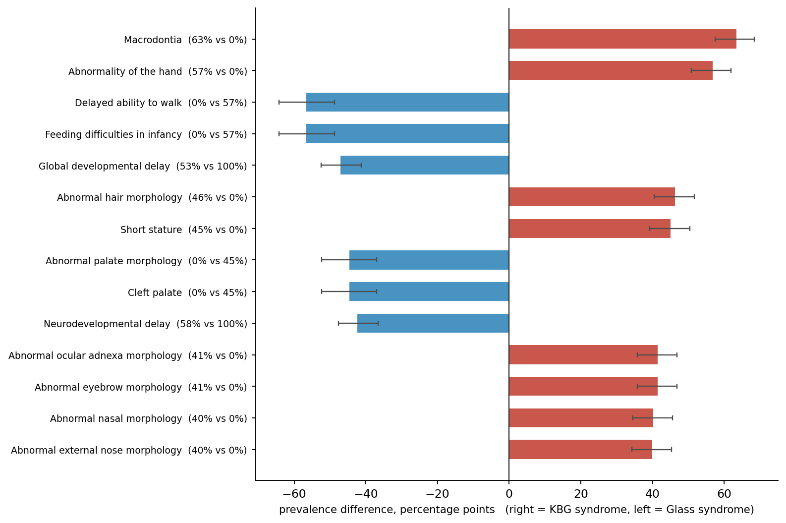

# Five case studies on real published rare-disease cases

Everything in the main README is built on synthetic cohorts, which makes the figures
checkable against ground truth but proves nothing about real data. This is the answer
to that, on a corpus nobody involved in `phenotopo` curated.

**Data.** [Phenopacket Store](https://github.com/monarch-initiative/phenopacket-store)
release 0.1.27 — 10,377 GA4GH phenopackets covering 780 diseases, curated from the
published literature by the Monarch Initiative (Danis et al., *Genetics in Medicine*
2025). Downloaded on demand into `~/.cache/phenotopo`, never committed here.

**Analysis set.** The 16 diseases with n ≥ 80 patients — 2,691 cases. Smaller cohorts
are excluded because connectivity ratios built on a handful of expected edges are
unstable, which is the package's own rule, applied to itself.

Reproduce with `python run_case_studies.py`; every number below comes from
[`case_studies_results.json`](case_studies_results.json).

---

## 1 · Does phenotype structure recover known disease structure?

**Yes, and strongly.** A cross-validated k-NN on SimGIC distances recovers the
**reported diagnosis in 93.8 %** of cases against a 17.2 % majority baseline.

Under the robustness protocol (SimGIC and cosine × k = 10/15/30, 1,000 permutations,
200 bootstrap draws, verdict only if it holds in all six configurations):

- **all 16 diseases are robustly cohesive** — tightest are Pseudohypoparathyroidism Ia
  (ratio 35.5), CVID 13 (33.6), Netherton syndrome (29.0), MTDPS13 (28.1);
- **104 of 120 disease pairs are robustly separated**;
- **exactly one pair blends**: *Stolerman neurodevelopmental syndrome* (KDM6B, n = 84)
  and *White-Sutton syndrome* (POGZ, n = 117), ratio 3.1.

That single blend is the interesting result. Two different genes, two different
disease names, and the published phenotypes are not separable: both are chromatin-
related neurodevelopmental syndromes described mostly through nonspecific
developmental delay. The method does not invent structure where the biology is shared.

## 2 · Can annotation depth manufacture apparent separation?

The check has to fire where the confound exists and stay quiet where it does not.
Both happen here.

- **Across all 16 diseases: risk LOW.** Balanced accuracy 91.8 % from phenotype versus
  27.2 % from term counts alone (permutation baseline 6.2 %) — counts explain about a
  quarter of the lift.
- **For the most unequally annotated pair: risk HIGH.** Tubulointerstitial kidney
  disease (median 2 terms per published case) versus Kabuki syndrome 2 (median 10):
  phenotype 100 %, counts alone 87.2 % against a 50.4 % baseline. Those two are
  perfectly separable by *how many terms the authors wrote down*, before any biology.

Median terms per case range from 2 to 12 across these 16 diseases — a threefold spread
driven by reporting convention, not by how complex the disease is.

## 3 · Does discordance find atypical published patients?

**83 of 2,691 cases (3.1 %)** sit in a phenotype neighbourhood dominated by a different
reported diagnosis. The rate is far from uniform: 30 % of Stolerman cases, 9 % of
Kabuki 2 and White-Sutton, 6 % of Kleefstra — the same NDD group that blends in case 1.

Example — *Individual 17 (published as Individual 1 in Bramswig et al., 2017)*,
reported as Stolerman syndrome, whose 15 nearest neighbours are 53 % White-Sutton.
`explain_outlier` says why: unusual for its neighbourhood are *unilateral renal
agenesis* and *agenesis of the corpus callosum*; expected but absent are *global
developmental delay*, *hypoplasia of the corpus callosum* and *microcephaly*.

This is not a claim that the diagnosis is wrong — these are molecularly confirmed
published cases. It is what the tool is for: *phenotypically discordant with the
assigned group*, i.e. worth a second look.

## 4 · Which HPO terms distinguish two related disorders?

KBG syndrome (ANKRD11, n = 333) versus Glass syndrome (SATB2, n = 157) — both
neurodevelopmental with dysmorphism. Of 180 terms tested, **46 pass** both the
max-statistic permutation and the 15 pp effect threshold:

| Term | KBG | Glass | Difference |
|---|---:|---:|---:|
| Macrodontia | 63 % | 0 % | **+63 pp → KBG** |
| Abnormality of the hand | 57 % | 0 % | +57 pp → KBG |
| Delayed ability to walk | 0 % | 57 % | +57 pp → Glass |
| Feeding difficulties in infancy | 0 % | 57 % | +57 pp → Glass |
| Global developmental delay | 53 % | 100 % | +47 pp → Glass |
| Abnormal hair morphology | 46 % | 0 % | +46 pp → KBG |

Macrodontia at the top is the sanity check: macrodontia of the upper central incisors
is the textbook hallmark of KBG syndrome. The method recovers, without being told, the
feature clinicians use to make the diagnosis.

The zeros are the warning. *Delayed ability to walk* in 57 % of Glass cases and **0 %**
of KBG cases does not mean KBG patients walk on time — it means the two cohorts were
curated from different papers, and one set of authors used that term while the other
recorded motor delay differently. A prevalence of exactly zero in a cohort of 333 is a
vocabulary boundary, not a clinical one. This is the same phenomenon the annotation-bias
check exists for, showing up inside a group comparison: the statistics are sound, and
the interpretation still needs someone who knows how the data were written down.

## 5 · Do explicitly excluded phenotypes carry information?

**77 %** of these published cases record at least one phenotype as looked-for-and-absent —
information that a plain list of HPO terms discards. Adding it to the similarity
(`distance("simgic", negatives="use")`) raises diagnosis recovery from **93.8 % to 96.0 %**,
a 2.2-point gain from data that was already there and normally thrown away.

---

## Caveats

These matter more than the numbers.

1. **Published cases are not a clinic.** Phenopacket Store is curated from case reports,
   which favour typical and severe presentations. Atypical patients — precisely the ones
   case 3 is about — are systematically under-represented, so 3.1 % discordance is a
   floor, not an estimate of what a real cohort holds.
2. **The label is the reported diagnosis**, molecularly confirmed but assigned by the
   original authors. "Recovers the diagnosis in 93.8 %" means agreement with that label.
3. **These cohorts are cleaner than clinical records**: curated by one team, to one
   standard, with propagation-ready HPO. Expect lower recovery on hospital data.
4. **16 diseases of 780.** The n ≥ 80 cut selects diseases that are common enough to be
   published often; nothing here generalises to the long tail.
5. **Discordance is not misdiagnosis** and cohesion is not diagnostic validity.
6. **Curation vocabulary leaks into every comparison.** Terms at exactly 0 % in one
   cohort and 50 %+ in another usually mark a difference between curating teams rather
   than between diseases (see case 4). Effect sizes protect against noise, not against
   two groups being described in different words.

## Citation

Danis D, Bamshad MJ, Bridges Y, et al. *A corpus of GA4GH phenopackets: case-level
phenotyping for genomic diagnostics and discovery.* Genetics in Medicine Open, 2025.
